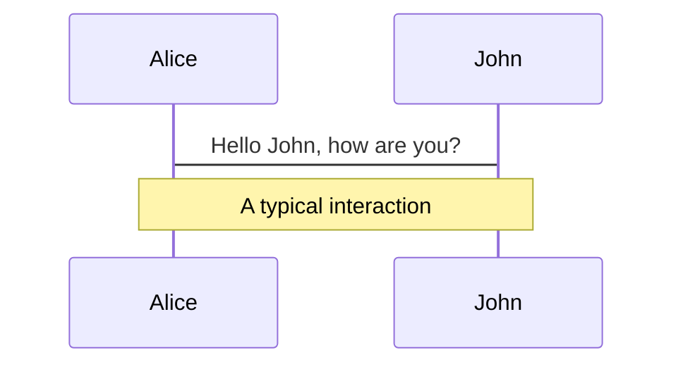
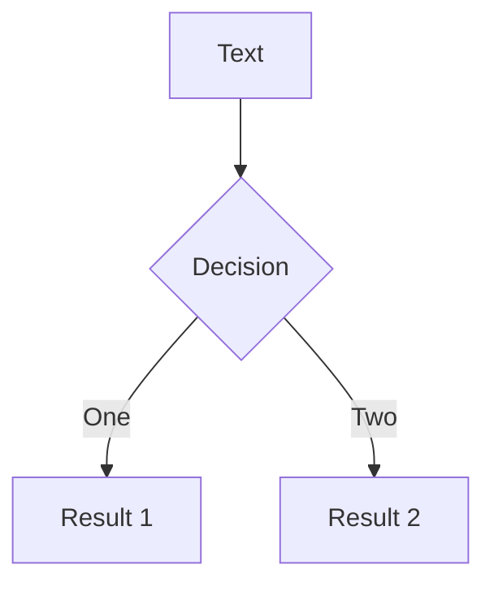
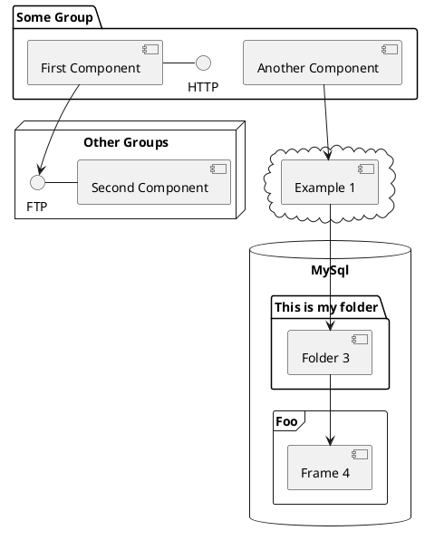

# Functional Programming

in Scala

---
layout: image-right
image: images/img-127.jpg
---

# About Me

- (2016) Computer Science graduate of Cedarville
- (2016) Java - Principal Financial Group
- (2019) Scala - Dwolla
- (2021) Scala - Rally Health (UHG)
- (2022) Scala - Axoni


## How to stay in touch
collinkueter@gmail.com

<!--
- Introduce family
- Briefly talk about experience
-->

---
---
# Where I Work


<style>
img {
  background: white
}
</style>
<br>

- New York-based capital markets technology firm that specializes in distributed ledger infrastructure
- Provides secure, multiparty infrastructure to automate synchronization of information and processes across entire markets

<!--
- Discuss what I do at Axoni, Data Completeness "squad" 
-->

---
layout: section
---

# Goal

---
layout: section
---

Introduction to Functional Programming (FP)

---
layout: section
---

Show how Functional Programming is better

---
---

# History of Functional Programming
- (1930) Roots in academia, evolving from the lambda calculus (Alonzo Church in the 1930s), a formal system of computation based only on functions
- (late 1950's) The first high-level functional programming language, LISP, was developed for the IBM 700/7000 series of scientific computers by John McCarthy while at MIT.
- (1985) Miranda is a lazy, purely functional programming language designed by David Turner, but was proprietary software
- (1990) Haskell - A committe was formed to consolidate existing functional languages into a common one to serve as a basis for future research in functional-language design
- (2001/2004) Scala
- (2022) Scala - one of the top paying languages (median income $96,979 Stack Overflow Developer Survey)

---
---

# Review: Mathematical Functions
<br>
A function from a set `X` to a set `Y` is an assignment of an element of `Y` to each element of `X`.
- The set X is called the domain of the function
- The set Y is called the codomain of the function.

Represented as:
$$
\begin{aligned}
\operatorname {f} (x)=x+1 \\
(x)\mapsto x+1 \\
\operatorname {f} \colon \mathbb {Z} &\to \mathbb {Z} \\
\newline
\operatorname {f}(5) = 5 + 1 = 6
\end{aligned}
$$

<!-- 
In programming functions can update a database, mutate some variables, do nothing, throw exceptions, etc.

Mathematical function always evaluate to the same thing given the same input

Mathematical functions are a thing, values that you can manipulate

We want to borrow this same concept which makes our functions act the same

so we create rules to make them act the same 

We call these Pure Functions or function which have no side effects

-->

---
---
# Why do we want to do this? 

- Make our programs easier to write
- Make our pgorams easier to understand

---
---

Consider an example:
```scala
x = [1,2,3]
y = f(x)
x = ???
```

<!-- 
When we have no side effects x never changes
 -->
---
---

Now let us say we call a very _complicated_ function on `x`

```scala
x = [1,2,3]
y = f(a(x) + b(x) * c(x) - 42 * (d(x) - e(x)) + floor(g(x * 3) * max(2*4)))
x = ???
```

<!--
x still does not change
-->
---
---
Let us consider another example where x is mutated

```scala
x = [1,2,3]
t = {
      x[1] = 5
      f(a(x) + b(x) * c(x))
    }
y = t + f(a(x) + b(x) * c(x) - 42 * (d(x) - e(x)) + floor(g(x * 3) * max(2*4)))
x = ???
```

<!-- 
We now have to look through all of the code again to ensure that it doesn't mutate our parameter

How do we fix this problem? Immutability, once you create something you cannot change it.

-->
---
layout: section
---

# Immutability

---
---
# How do we get anything done? 

Give me a copy, but change this one thing

In Scala we have higher-order functions like `map` and `filter` which help us

```scala
val names = List("jane", "jon", "mary", "joe")
val result = names.filter(_.startsWith("j"))
             .map(_.capitalize)
// result = List("JANE", "JON", "JOE")
```
<br>
In Java
```java
List<String> names = Arrays.asList({"jane", "jon", "mary", "joe"});
List<String> result = new ArrayList<>();
for(String name : names){
  if(name.charAt(0) == 'j') {
    result.add(name.toUppercase());
  }
}
```

<!-- 

We apply a function to an existing collection to create a new collection. 

persistent data structures - huge lists 

-->
---
---
# Review

1. Pure Function (or Functions with No Side Effects)
2. Immutability

<!-- 
Two more concepts
Two benefit of pure functions
 -->

---
---
# Local Reasoning

---
---

# Referential Transparency

---
---

# Shorter Code
Functional style code is typically much shorter

---
---
# Parallelization is trivial

---
---

# Why Functional Programming?

- No side effects
- Immutability 
- Local Reasoning
- Referential Transparency
- Functional style code is typically much shorter
- Parallelization is trivial

---
---

# Declarative vs Imperative

Start
Turn on your shoes size 9 1/2.
Make room in your pocket to keep an array[7] of keys.
Put the keys in the room for the keys in the pocket.
Enter garage.
Open garage.
Enter Car.
... and so on and on ...

Put the milk in the refrigerator.
Stop.
Declarative, whereof functional is a subcategory:

Milk is a healthy drink, unless you have problems digesting lactose.
Usually, one stores milk in a refrigerator.
A refrigerator is a box that keeps the things in it cool.
A store is a place where items are sold.
By "selling" we mean the exchange of things for money.
Also, the exchange of money for things is called "buying".
... and so on and on ...

Make sure we have milk in the refrigerator (when we need it - for lazy functional languages).

---
---
# Types

---
---

# Scala Functions

```scala
def f(x: Integer): Integer = x + 1

val f: Integer => Integer = (x: Integer) => x + 1
```
<!-- 
Mechanics of a scala function
 -->
---
---
# Scala Functions

```scala
def f(x: Integer): Integer = x + 1

val f: Integer => Integer = (x: Integer) => x + 1
```

<Arrow x1="120" y1="220" x2="100" y2="125" />

---
---
# Scala Functions

```scala
def f(x: Integer): Integer = x + 1

val f: Integer => Integer = (x: Integer) => x + 1
```

<Arrow x1="120" y1="220" x2="112" y2="125" />

---
---
# Scala Functions

```scala
def f(x: Integer): Integer = x + 1

val f: Integer => Integer = (x: Integer) => x + 1
```

<Arrow x1="120" y1="220" x2="150" y2="125" />

---
---
# Scala Functions

```scala
def f(x: Integer): Integer = x + 1

val f: Integer => Integer = (x: Integer) => x + 1
```

<Arrow x1="120" y1="220" x2="215" y2="125" />

<!-- Great, but we can do this in Java or any other language! -->

---
---

# Why Functional Programming?

- Local Reasoning
- Immutability 
- No side effects (we'll talk about this later)
- Functional style code is typically much shorter
- Parallelization is trivial

<!--
You can have `style` tag in markdown to override the style for the current page.
Learn more: https://sli.dev/guide/syntax#embedded-styles
-->

---
transition: slide-up
---

# Navigation

Hover on the bottom-left corner to see the navigation's controls panel, [learn more](https://sli.dev/guide/navigation.html)

### Keyboard Shortcuts

|     |     |
| --- | --- |
| <kbd>right</kbd> / <kbd>space</kbd>| next animation or slide |
| <kbd>left</kbd>  / <kbd>shift</kbd><kbd>space</kbd> | previous animation or slide |
| <kbd>up</kbd> | previous slide |
| <kbd>down</kbd> | next slide |

<!-- https://sli.dev/guide/animations.html#click-animations -->

<p v-after class="absolute bottom-23 left-45 opacity-30 transform -rotate-10">Here!</p>

---
layout: image-right
image: https://source.unsplash.com/collection/94734566/1920x1080
---

# Code

Use code snippets and get the highlighting directly![^1]

```ts {all|2|1-6|9|all}
interface User {
  id: number
  firstName: string
  lastName: string
  role: string
}

function updateUser(id: number, update: User) {
  const user = getUser(id)
  const newUser = { ...user, ...update }
  saveUser(id, newUser)
}
```

<arrow v-click="3" x1="400" y1="420" x2="230" y2="330" color="#564" width="3" arrowSize="1" />

[^1]: [Learn More](https://sli.dev/guide/syntax.html#line-highlighting)

<style>
.footnotes-sep {
  @apply mt-20 opacity-10;
}
.footnotes {
  @apply text-sm opacity-75;
}
.footnote-backref {
  display: none;
}
</style>

---

# Components

<div grid="~ cols-2 gap-4">
<div>

You can use Vue components directly inside your slides.

We have provided a few built-in components like `<Tweet/>` and `<Youtube/>` that you can use directly. And adding your custom components is also super easy.

```html
<Counter :count="10" />
```

<!-- ./components/Counter.vue -->
<Counter :count="10" m="t-4" />

Check out [the guides](https://sli.dev/builtin/components.html) for more.

</div>
<div>

```html
<Tweet id="1390115482657726468" />
```

<Tweet id="1390115482657726468" scale="0.65" />

</div>
</div>

<!--
Presenter note with **bold**, *italic*, and ~~striked~~ text.

Also, HTML elements are valid:
<div class="flex w-full">
  <span style="flex-grow: 1;">Left content</span>
  <span>Right content</span>
</div>
-->


---
class: px-20
---

# Themes

Slidev comes with powerful theming support. Themes can provide styles, layouts, components, or even configurations for tools. Switching between themes by just **one edit** in your frontmatter:

<div grid="~ cols-2 gap-2" m="-t-2">

```yaml
---
theme: default
---
```

```yaml
---
theme: seriph
---
```


</div>

Read more about [How to use a theme](https://sli.dev/themes/use.html) and
check out the [Awesome Themes Gallery](https://sli.dev/themes/gallery.html).

---
preload: false
---

# Animations

Animations are powered by [@vueuse/motion](https://motion.vueuse.org/).

```html
<div
  v-motion
  :initial="{ x: -80 }"
  :enter="{ x: 0 }">
  Slidev
</div>
```

<div class="w-60 relative mt-6">
  <div class="relative w-40 h-40">
    
    
    
  </div>

  <div
    class="text-5xl absolute top-14 left-40 text-[#2B90B6] -z-1"
    v-motion
    :initial="{ x: -80, opacity: 0}"
    :enter="{ x: 0, opacity: 1, transition: { delay: 2000, duration: 1000 } }">
    Slidev
  </div>
</div>

<!-- vue script setup scripts can be directly used in markdown, and will only affects current page -->
<script setup lang="ts">
const final = {
  x: 0,
  y: 0,
  rotate: 0,
  scale: 1,
  transition: {
    type: 'spring',
    damping: 10,
    stiffness: 20,
    mass: 2
  }
}
</script>

<div
  v-motion
  :initial="{ x:35, y: 40, opacity: 0}"
  :enter="{ y: 0, opacity: 1, transition: { delay: 3500 } }">

[Learn More](https://sli.dev/guide/animations.html#motion)

</div>

---

# LaTeX

LaTeX is supported out-of-box powered by [KaTeX](https://katex.org/).

<br>

Inline $\sqrt{3x-1}+(1+x)^2$

Block
$$
\begin{array}{c}

\nabla \times \vec{\mathbf{B}} -\, \frac1c\, \frac{\partial\vec{\mathbf{E}}}{\partial t} &
= \frac{4\pi}{c}\vec{\mathbf{j}}    \nabla \cdot \vec{\mathbf{E}} & = 4 \pi \rho \\

\nabla \times \vec{\mathbf{E}}\, +\, \frac1c\, \frac{\partial\vec{\mathbf{B}}}{\partial t} & = \vec{\mathbf{0}} \\

\nabla \cdot \vec{\mathbf{B}} & = 0

\end{array}
$$

<br>

[Learn more](https://sli.dev/guide/syntax#latex)

---

# Diagrams

You can create diagrams / graphs from textual descriptions, directly in your Markdown.

<div class="grid grid-cols-3 gap-10 pt-4 -mb-6">







</div>

[Learn More](https://sli.dev/guide/syntax.html#diagrams)

---
src: ./pages/multiple-entries.md
hide: false
---

---
layout: center
class: text-center
---

# Learn More

[Documentations](https://sli.dev) · [GitHub](https://github.com/slidevjs/slidev) · [Showcases](https://sli.dev/showcases.html)
